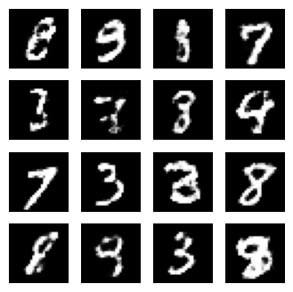

# MNIST GAN (Generative Adversarial Network)

This project implements a Generative Adversarial Network (GAN) to generate handwritten digits similar to those in the MNIST dataset. The GAN comprises two main components: a generator that creates new images and a discriminator that evaluates their authenticity. The objective is for the generator to produce images that are indistinguishable from real handwritten digits.

## Dataset

- The project uses the MNIST dataset, which is built into TensorFlow.

## Steps

The process involves the following steps:

1. **Loading the MNIST dataset** and preprocessing the images.
2. **Defining the generator and discriminator models.**
3. **Utilizing a custom training loop** to train the GAN over a specified number of epochs.
4. During training, **the generator and discriminator compete against each other**, leading to improved performance over time.
5. **Generating digits** using the trained model.

## Results

Here is an example of an image generated after 500 epochs:

Increasing the number of epochs may yield more realistic digits.